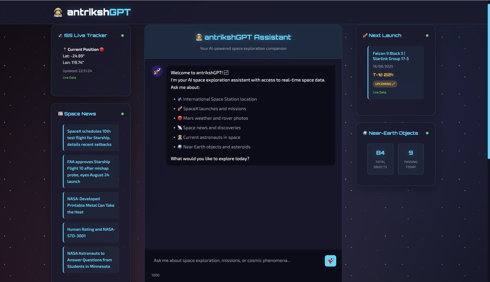

# antrikshGPT - Open-Source AI Space Explorer

[](https://antrikshgpt.vercel.app/)
[](https://opensource.org/licenses/MIT)
[](https://www.python.org/downloads/)
[](https://vercel.com/)

> **Antriksh** ( अंतरिक्ष ) means "space" in Sanskrit/Hindi.

**antrikshGPT** is an AI-powered space exploration web application that combines the power of a large language model (LLM) with real-time space data to create an immersive and educational cosmic experience. This version is optimized for easy, serverless deployment on Vercel.



## ✨ Key Features

- **Conversational AI:** Powered by an **LLM** via LangChain for accurate and engaging conversations about space.
- **Real-Time Space Data:** Integrates with **13 specialized space APIs** to provide live data on:
  - 🛰️ **ISS Tracking:** Real-time location of the International Space Station.
  - 🚀 **SpaceX Missions:** Details on upcoming and past launches.
  - 📰 **Space News:** The latest discoveries and mission updates.
  - 🧑‍🚀 **Astronaut Tracker:** Who is in space right now.
  - 🪐 **Planetary Data:** Rich information about celestial bodies in our solar system.
  - 🔭 **And much more!**

- **Production-Ready:** Built with a smart caching system, rate limiting, and robust error handling to ensure high availability and low latency.
- **Stunning UI:** A modern, responsive frontend with a beautiful space theme, CSS animations, and real-time updates via WebSockets.

## 🛠️ Technology Stack

- **AI/ML:** LLM, LangChain, LangGraph
- **Backend:** FastAPI, WebSockets, AsyncIO, AIOHTTP
- **Frontend:** HTML5, CSS3, JavaScript (ES6+)
- **Deployment:** Vercel (Serverless)
- **Authentication:** JWT, passlib, python-jose
- **Data Sources:** NASA, SpaceX, Launch Library, Open Notify, and more reliable space APIs.

## ⚙️ Getting Started

### Prerequisites

- Python 3.8+
- Vercel Account & Vercel CLI
- `pip` package manager

### Local Development

1.  **Clone the repository:**
    ```bash
    git clone git clone https://github.com/tarun7r/antrikshGPT.git
    cd antrikshGPT
    ```

2.  **Set up environment variables:**
    Create a `.env` file from the sample and add your API keys.
    ```bash
    cp env.sample .env
    ```
    - `GOOGLE_API_KEY`: Your Google AI API key for the LLM.
    - `SECRET_KEY`: A secret key for JWT. Generate one with `openssl rand -hex 32`.

3.  **Install dependencies:**
    ```bash
    pip install -r requirements.txt
    ```

4.  **Run the application:**
    The application uses a `users.json` file for user management. A default admin user is created with a random password on the first launch. Check the console output for the credentials.
    ```bash
    cd webapp/backend
    python3 main.py
    ```

5.  **Open your browser:**
    Navigate to `http://localhost:8000` to see the application in action.


## 🚀 Demo Queries

Try these queries to see the system's capabilities:

- *"Where is the ISS right now?"*
- *"What's the next SpaceX launch?"*
- *"What's the weather like on Mars?"*
- *"Who is currently in space?"*
- *"Show me recent photos from the Mars rover."*
- *"Tell me about black holes."*

## 📁 Project Structure

```
antrikshGPT/
├── api/
│   └── index.py            # Vercel serverless function entrypoint
├── config/
│   └── settings.py         # Configuration and API keys
├── shared/
│   ├── langchain_agent.py  # Core AI agent
│   └── space_apis.py       # Space API integrations
├── webapp/
│   ├── backend/
│   │   └── main.py         # FastAPI server
│   └── frontend/           # Static frontend files
├── requirements.txt        # Python dependencies
├── users.json              # Simple user database
├── vercel.json             # Vercel deployment configuration
└── README.md
```

## 📜 License

This project is open-source and available under the [MIT License](LICENSE).

---

**Built with a passion for space exploration and AI innovation.**

*"ऋतं सत्यं परं ब्रह्म।" - "Cosmic order (ṛta) and truth (satya) are the supreme Brahman."*
